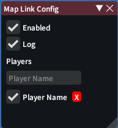

# Map Link

[Video Demo](https://github.com/sofia819/ffxiv-map-link/assets/17885737/e92997c8-c5c0-432f-a9a0-6b653f2332ad)

Automatically opens the last linked flag coordinates from chat.

## Installation

Note: this is my first attempt at C# and Dalamud plugins, so this is filled with bad coding practices and bugs.

[Custom Plugin Repository](https://gist.githubusercontent.com/sofia819/fb17fff59d39923fde123538dbf8b92b/raw/map-link.json)

## Settings

-   Enabled: turns MapLink on/off
-   Log: logs `[MapLink] Player Name posts a map link` in chat
-   Player Name Input: adds `Player Name` to the filter
-   Player Name :heavy_check_mark:: enables filtering by `Player Name`
-   Player Name :x:: removes `Player Name` from the filter

#### Notes

-   If the filter is empty or if all filter entries are disabled, it will watch all of the messages

## Commands

-   `/mpl`: toggles MapLink on/off and logs `[MapLink] ON/OFF` in chat
-   `/mpl cfg`: opens MapLink settings
-   `/mpl [Player Name]`: adds a player to the filter
